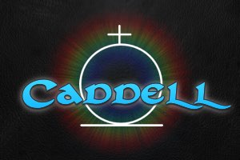
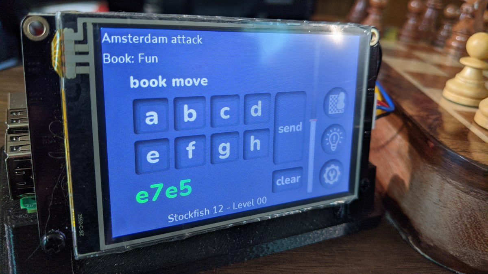
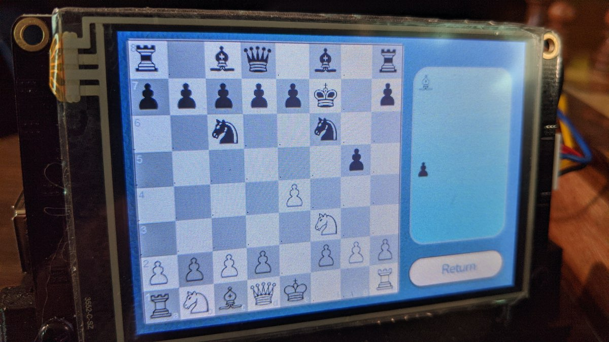
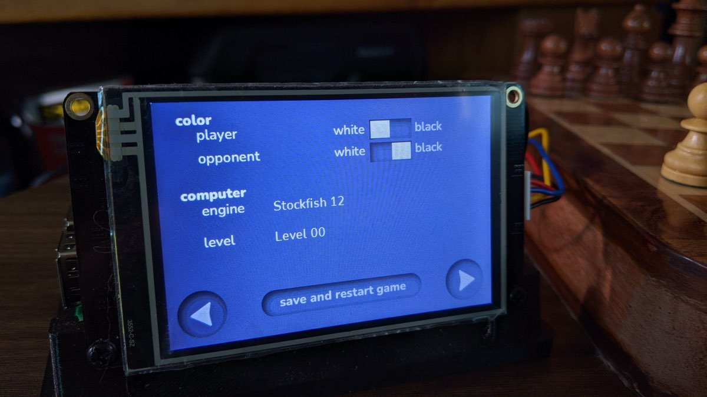
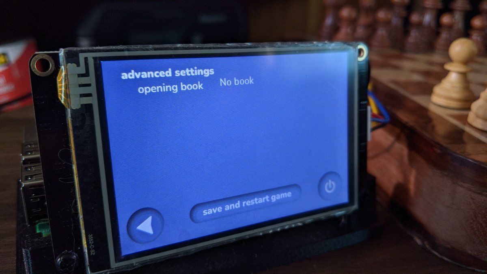
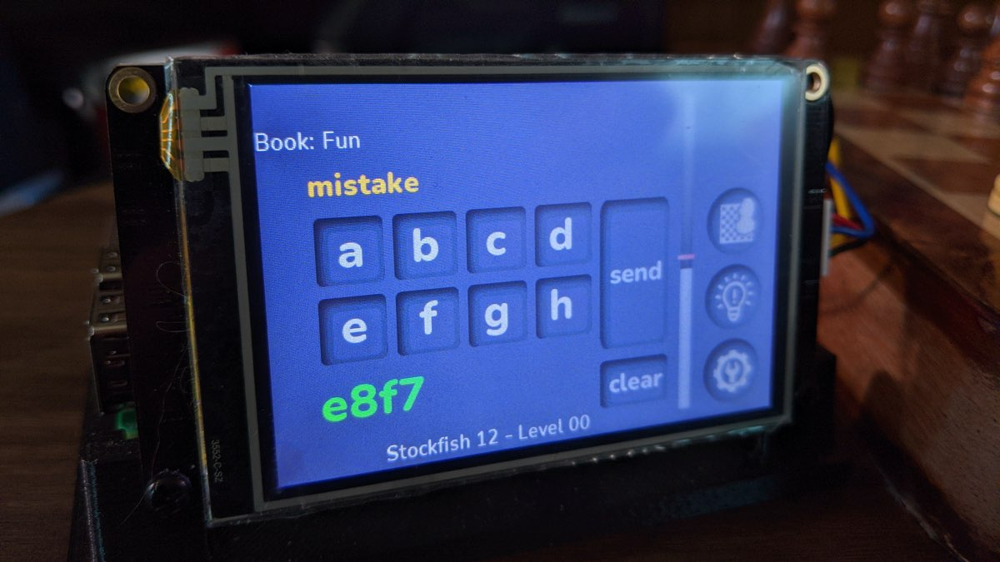
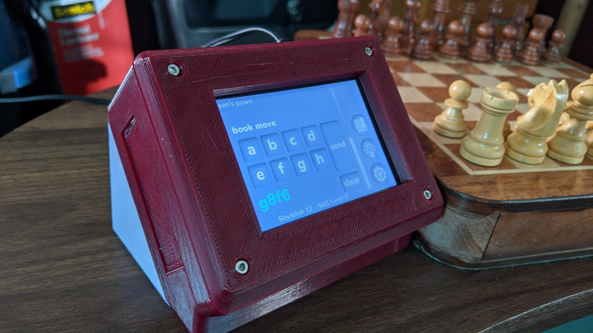
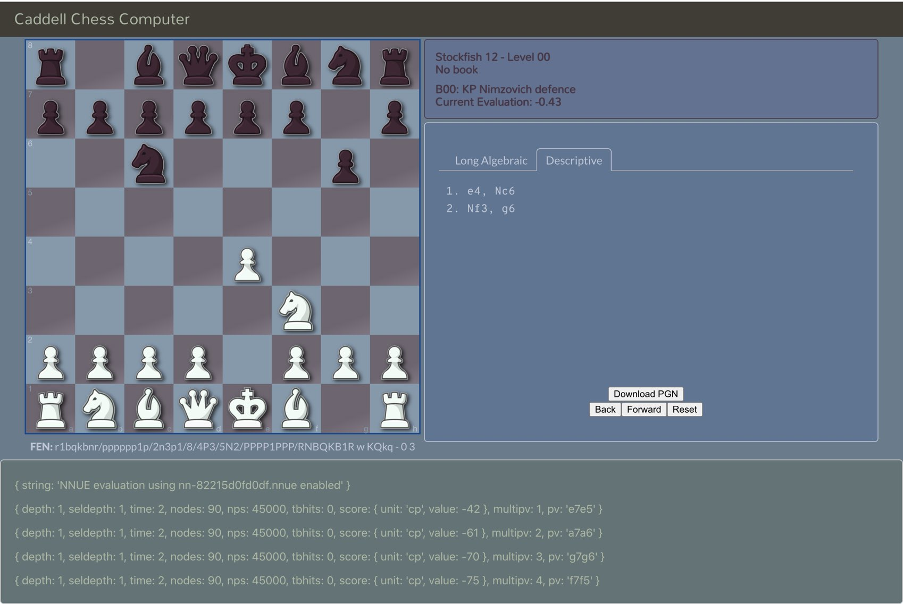

<!-- PROJECT LOGO -->
 

  

  <h3 align="center">Caddell Chess Computer</h3>

  

    Play chess against modern chess engines without the need for a computer, smartphone, or internet.
     
    <a href="https://github.com/caddellchess/caddell-chess"><strong>Explore the docs »</strong></a>
     
     
    <a href="https://github.com/caddellchess/caddell-chess/issues">Report Bug</a>
    ·
    <a href="https://github.com/caddellchess/caddell-chess/issues">Request Feature</a>
  

<!-- TABLE OF CONTENTS -->

  
<h2 style="display: inline-block">Table of Contents</h2>

  <ol>
    <li>
      <a href="#about-the-project">About The Project</a>
      <ul>
        <li><a href="#built-with">Built With</a></li>
        <li><a href="#terminology">A Little Brief Terminology</a></li>
      </ul>
    </li>
    <li><a href="#getting-started">Getting Started</a></li>
    <li><a href="#usage">Usage</a></li>
    <li><a href="#browser">Browser</a></li>
    <li><a href="#roadmap">Roadmap</a></li>
    <li><a href="#contributing">Contributing</a></li>
    <li><a href="#license">License</a></li>
    <li><a href="#contact">Contact</a></li>
    <li><a href="#acknowledgements">Acknowledgements</a></li>
  </ol>

<!-- ABOUT THE PROJECT -->
## About The Project

Play chess against modern chess engines without the need for a computer, smartphone, or internet.

Caddell, a stand alone chess computer, was birthed from the desire to play against the Rodent chess
engine and its personality files, without using a computer or smartphone (and thus without the
potential for distraction that those devices can bring). Caddell is for playing chess OTB (Over The Board)
against a computer opponent. No special board or pieces are required... moves are inputted to the computer
using long algebraic notation. Caddell might be compared to the
[Chess Challenger 7](https://www.schach-computer.info/wiki/index.php/Fidelity_Chess_Challenger_7) from decades ago, I
know I thought of my long lost Chess Challenger 7 often while writing Caddell.

The Caddell Chess Computer can theoretically utilize any chess engine that supports the UCI protocol and that has been
ported to the Raspberry Pi platform. To date [Stockfish 12](https://stockfishchess.org/) and
[Rodent IV](http://www.pkoziol.cal24.pl/rodent/rodent.htm) have undergone the most compatibility testing.

### Built With

* [Raspberry Pi 3 model B+](https://www.raspberrypi.org/products/raspberry-pi-3-model-b-plus/)
* [Javascript](https://www.javascript.com/)
* [Redux](https://redux.js.org/)
* [Nextion displays](https://nextion.tech/)
* A handful of npm packages (listed in [package.json](http://github.com/caddellchess/blob/main/caddell-chess/package.json))

Caddell isn't meant to be a copy or a rewrite of any of the fantastic projects that already exist. I hope
it fills a hole (no matter how small) and can stand on its own merits. Choosing Javascript as the
programming language further emphasizes the individuality of this project.

#### A Little Brief Terminology

<dl>
  <dt>Chess GUI</dt>
  <dd>The Caddell Chess Computer is a <em>Chess GUI</em> and relies upon <em>Chess Engines</em> to be fully operational. A Chess
  GUI (like Caddell) is the interface between the human player and the computer program that has all the smarts
  to play challenging chess. A Chess GUI lets you choose black or white, lets you select the engine and the strength
  of the engine. A Chess GUI should be responsible for knowing if your move is valid, for reporting check or mate, etc...</dd>

  <dt>Chess Engine</dt>
  <dd>A <em>Chess Engine</em> generally isn't thought to have a human usable interface, and instead relies upon a
  <em>Chess GUI</em> for play. The Chess Engine knows the rules of chess and can make the best (or so, depending on
  a variety of factors like engine level, opening book, etc) move for any given board position. Caddell is <strong>not</strong>
  a chess engine and cannot determine a best move to play.</dd>

  <dt>Personality [files]</dt>
  <dd>Some <em>Chess Engines</em> have an option to use a <em>Personality File</em>, optionally in addition to setting
  a strength level. A personality defines the <em>style</em> of play... perhaps one personality favors keeping all
  pawns, while another might stress pawn trades very early in the game. Personality files can make an engine seem more
  human-like in its play.</dd>

  <dt>Opening Book(s)</dt>
  <dd>The Caddell Chess Computer allows you to select from a number of <em>Opening Books</em> to play against. The way
  Caddell uses this feature is to play moves from the opening book, bypassing the chess engine, for as long as lines
  of play continue to exist in the book. Books exist that favor semi-open, or Indian, or even "fun" openings. Using one
  of these books can guarantee that you play against an opening you are learning, or just to add some novelty to your
  play.</dd>
</dl>

<!-- GETTING STARTED -->
## Getting Started

To get a local copy up and running you will need a Raspberry Pi board, the RPi 3 model B+ was used
during the creation of Caddell and therefore is known to work. You will also need to acquire a
Nextion 3.5" display (available on Amazon, banggood, and other online retailers). The basic and
enhanced version of the Nextion display both work fine. The "Intelligent" series was not tested.

Once the hardware is acquired you can follow the steps in the
[installation guide](http://github.com/caddellchess/caddell-chess/blob/main/INSTALLATION.md).

<!-- USAGE EXAMPLES -->
## Usage

The following photos intend to give a little more info about the project as well as to begin to instruct on how
to use the Caddell Chess Computer.

This is the main playing screen of Caddell, where you'll spend most of your time. Moves are entered in long algebraic
notation using the two rows of buttons, labeled A-H. When the letter for the square is tapped the buttons switch to
numerics, 1-8, and then back again to letters when a number is tapped. This conserves screen real estate without
impeding the ability to enter moves.

On this screen you can see the opening that Caddell has determined for this game. Below the opening name you can see
that this game is using an opening book called "Fun". At the bottom of the screen lists the engine and level (and
personality if supported by the engine).

We can also see that Caddell believes your last move followed the opening precisely. The horizontal bar shows Caddell's
idea of who has advantage.

The buttons on the right side of the screen show the current board position, a hint, and settings, from top to bottom.

This screen is reached by tapping the "show board" button on the main page. It shows the current position and the
pieces that have been removed from the game. Moves can not be made from this page... the value of this screen is
realized when a cat knocks your physical pieces to the floor.

Here we see the settings page. You can choose color, engine, and level on this screen, all by tapping on the item
you want to change. In the case of engine and level a "drop down" list is displayed that you can scroll through and
choose your desired item. If an engine has personalities they can be chosen from the next screen, reached by hitting
the right arrow.

This is the second settings page. This page allows you to choose an opening book, and if the engine from the prior
page supports personalities you will be given the chance to choose one here.

Caddell is judging you while you play and will let you know if you've made a mistake, a blunder, or by some chance a
spectacular move.

The "case" shown in the previous photos is a very simple display stand that was used during the majority of Caddell's
development. You can find it on [Thingiverse](https://www.thingiverse.com/thing:4437991) if you're interested. Work
is underway for developing a more robust and protective case... a prototype is shown here. A final version of a case
won't be released until room for a speaker is incorporated.

<!-- BROWSER FEATURE -->
## Browser

Only a limited functionality beta feature for now, Caddell also has a browser component. The browser component is meant
to compliment the stand alone chess computer and not to replace any of its features or functionality. An enjoyable game
will always be able to be played without using a browser at all.

Some of what the browser component offers includes:

- seeing a large view of the board position (larger than on the 3.5" screen), for replacing pieces when a cat knocks
your board over or a dog's tail swipes the pieces away
- ability to step backwards and forward moves in the game... it doesn't change the state of the game, it just allows
you to view the history
- view the move history in either long algebraic or descriptive notation
- ability to see the engine's _info_ responses
- ability to download the PGN of the game
- choose engine, level, personality (if applicable), and color

Partial Future Browser Features Planned

- set more engine parameters than just level and personality
- read info about engines, pesonalities, and books
- set more options for the engine than are exposed on the stand alone device

To prepare and use the browser component please see the [browser component installation guide](http://github.com/caddellchess/caddell-chess/blob/main/client/INSTALLATION.md)

<!-- ROADMAP -->
## Roadmap

See the [open issues](https://github.com/caddellchess/caddell-chess/issues) for a list of proposed features (and known issues).

<!-- CONTRIBUTING -->
## Contributing

Contributions are what make the open source community such an amazing place to be learn, inspire, and create. Any contributions you make are **greatly appreciated**.

1. Fork the Project
2. Create your Feature Branch (`git checkout -b feature/AmazingFeature`)
3. Commit your Changes (`git commit -m 'Add some AmazingFeature'`)
4. Push to the Branch (`git push origin feature/AmazingFeature`)
5. Open a Pull Request

<!-- LICENSE -->
## License

Distributed under the GNU General Public License v3.0 or later. See `LICENSE` for more information.

<!-- CONTACT -->
## Contact

Caddell Chess - caddellchess@gmail.com

Project Link: [https://github.com/caddellchess/caddell-chess](https://github.com/caddellchess/caddell-chess)

<!-- ACKNOWLEDGEMENTS -->
## Acknowledgements

Although the Caddell Chess Computer is a stand alone work, this idea was inspired by the successful
[picochess](http://docs.picochess.org/en/latest/) by locutusofpenguin. Features, and priority of them, were influenced
by picochess, and in some cases even directory structure. No code was borrowed from picochess, and in fact different
technologies were used to create Caddell (Javascript vs Python, and as a result even otherwise very useful Python
packages were not [able to be] used).

The Caddell Chess Computer could not have been possible without the prior good works by several others. In the
npm registry exists a few helper packages to make dealing with chess logic easier. The specific packages used can
be found in this project's package.json file.

And last but far from least, a huge debt of gratitude is due to the chess engines that are readily available. Caddell
would be at best a proof-of-concept project only without a chess engine to actually play a game against.
